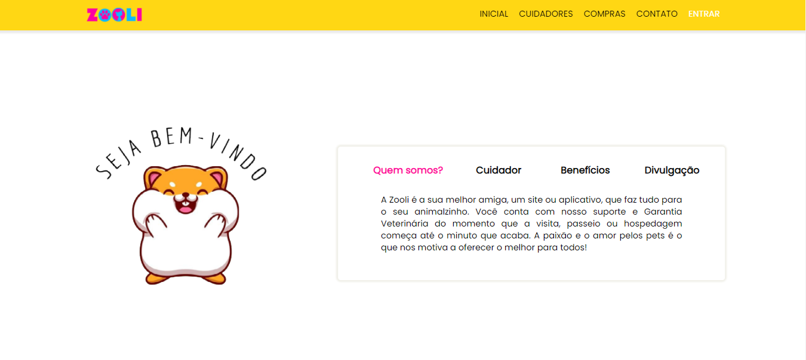

# Projeto de TCC: Plataforma de Cuidadores de Animais e Produtos de Tecnologia

Bem-vindo ao repositório da versão beta do projeto de TCC! Esta é uma plataforma responsiva e desenvolvida como parte do Trabalho de Conclusão de Curso (TCC) de julho de 2023, de Técnico em Desenvolvimento de Sistemas que visa oferecer uma solução abrangente para os donos de animais de estimação. O projeto consiste em um site que disponibiliza cuidadores de animais de estimação, uma variedade de produtos de tecnologia para facilitar a vida dos donos de animais.

## Objetivos do Projeto

O objetivo principal deste projeto é fornecer uma plataforma unificada que atenda às necessidades dos donos de animais de estimação, oferecendo:

- Acesso a uma ampla rede de cuidadores de animais de estimação.
- Uma variedade de produtos de tecnologia projetados para melhorar o cuidado e a interação com os animais.

## Cores Principais

- Amarelo:  `#FFD714`
- Azul:  `#0DB8FE`
- Rosa:  `#FE0182`

As cores principais do projeto são amarelo, rosa e azul, refletindo uma combinação de elegância e modernidade, além de transmitir uma sensação de calor e conexão emocional com os animais de estimação.

## Imagem do Projeto

## Acesso ao Projeto

Você pode acessar o site do projeto [aqui](https://zoolisite.000webhostapp.com/).

Obrigado por conferir nosso projeto de TCC!

